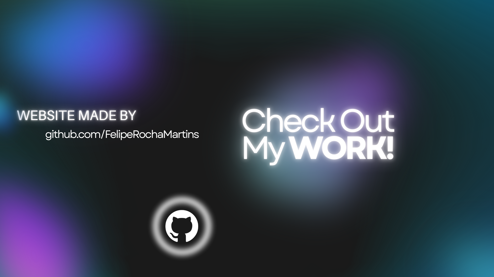

# Eclectic Stories

**Eclectic Stories** is a platform where users can discover, read, and share diverse stories across various genres. Built with a focus on performance, scalability, and user experience, this project demonstrates modern web development practices.

## Features

- **Story Management**: Users can browse a library of stories, with each story divided into pages for easier reading.
- **Book Pagination**: Dynamic pagination for stories, allowing users to navigate through book pages efficiently.
- **Responsive Design**: Optimized for different screen sizes using Bootstrap, ensuring a smooth experience on both desktop and mobile.
- **Dynamic Book Covers**: Displays book covers or a default placeholder when no cover is provided.
- **User Authentication and Role Management**: Secure login with role-based access control to manage story editing and publishing.
- **Gradients and UI Styling**: Applied background gradients and customized UI elements for a visually appealing interface.

## Technologies Used

- **ASP.NET Core MVC**: Backend framework for building the web application.
- **Entity Framework Core**: ORM used for database management, handling relations between entities like books and pages.
- **C#**: Main programming language for the backend.
- **Razor Pages**: For building dynamic web pages with server-side rendering.
- **AutoMapper**: Simplifies object-to-object mapping between models and view models.
- **Bootstrap**: Used for the responsive design of the UI.
- **SQL Server**: Database for storing user data, stories, and other content.
- **JavaScript & jQuery**: For enhancing the front-end functionality.
- **Git**: Version control system used for managing the project’s codebase.

## Project Structure

The project is divided into two main sections:

- **Presentation Layer**: Contains the Razor views and controllers for handling user interaction and displaying content.
- **Data Layer**: Contains the database models, migrations, and repository logic. 

## Installation

1. Clone the repository:
    ```bash
    git clone https://github.com/yourusername/eclectic-stories.git
    ```

2. Navigate to the project directory and restore dependencies:
    ```bash
    cd eclectic-stories
    dotnet restore
    ```

3. Set up the database:
    - Update the connection string in the `appsettings.json`.
    - Run the migrations:
    ```bash
    dotnet ef database update
    ```

4. Run the application:
    ```bash
    dotnet run
    ```

## Contribution Guidelines

We welcome contributions! Here's how you can get involved:

1. Fork the repository.
2. Create a new branch for your feature or bugfix:
    ```bash
    git checkout -b feature/your-feature
    ```
3. Commit your changes:
    ```bash
    git commit -m "Add your message here"
    ```
4. Push to the branch:
    ```bash
    git push origin feature/your-feature
    ```
5. Open a pull request.

## License

This project is licensed under the MIT License. See the [LICENSE](LICENSE) file for details.



